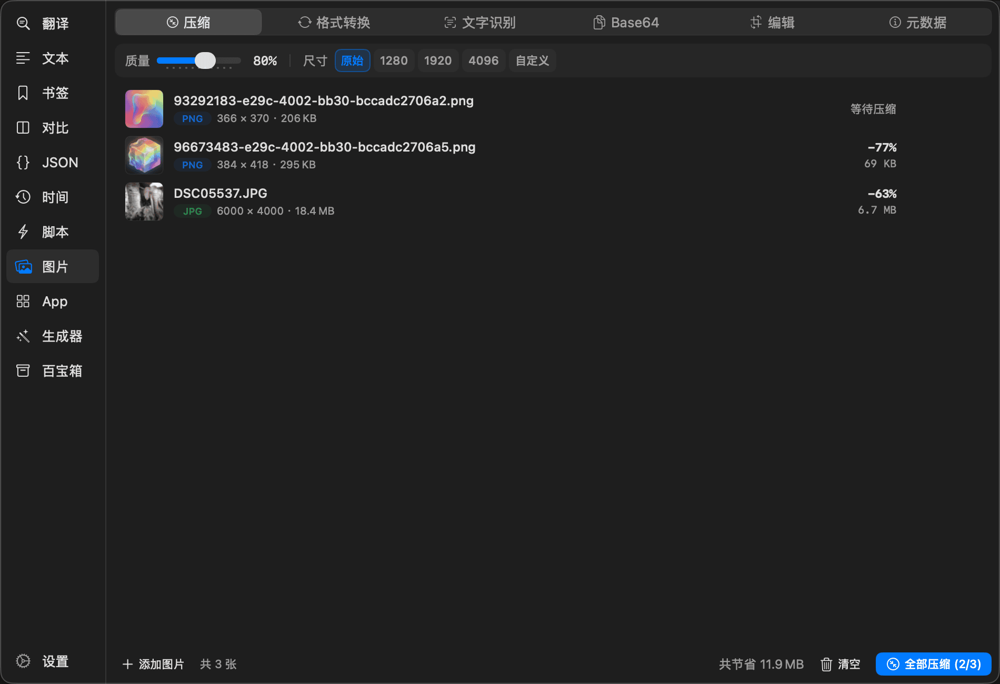
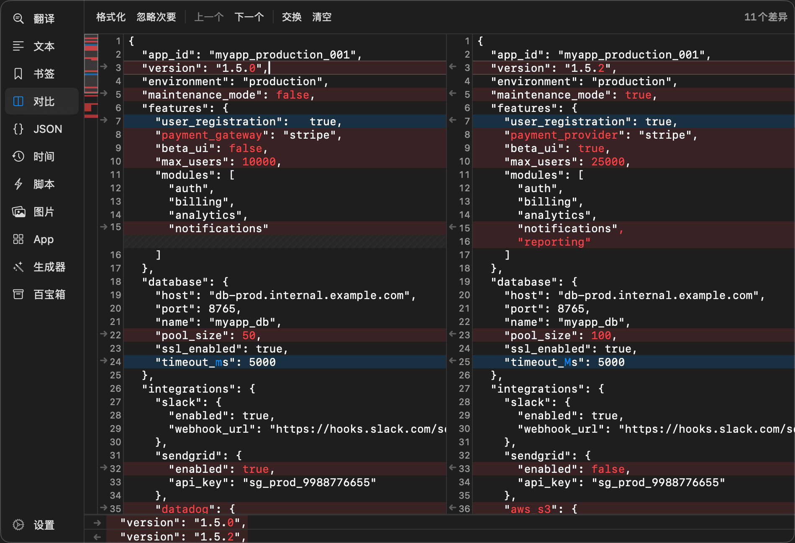
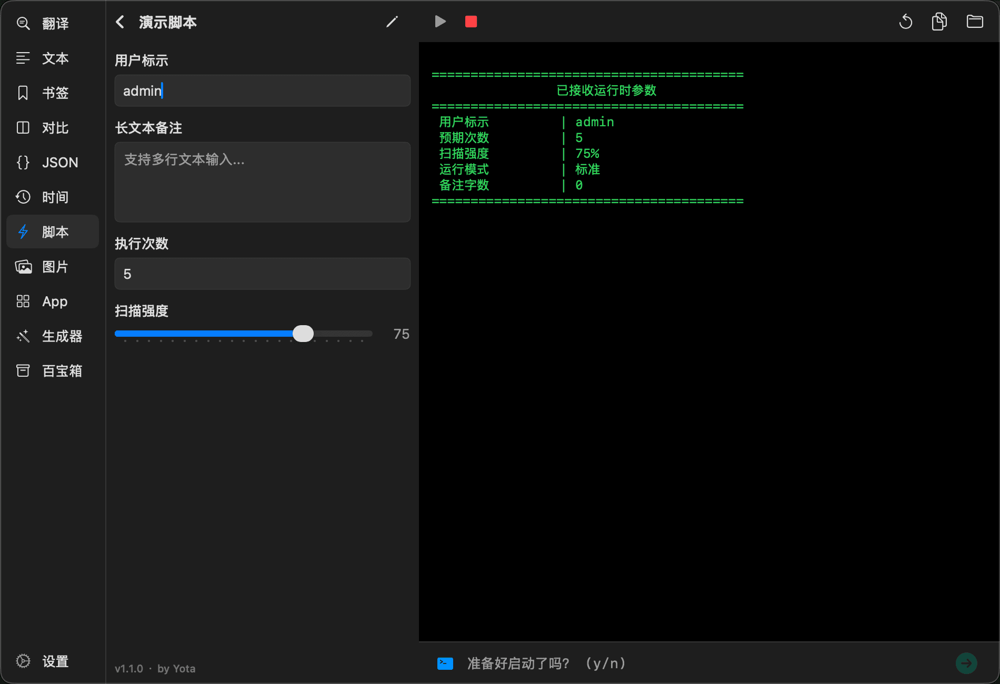
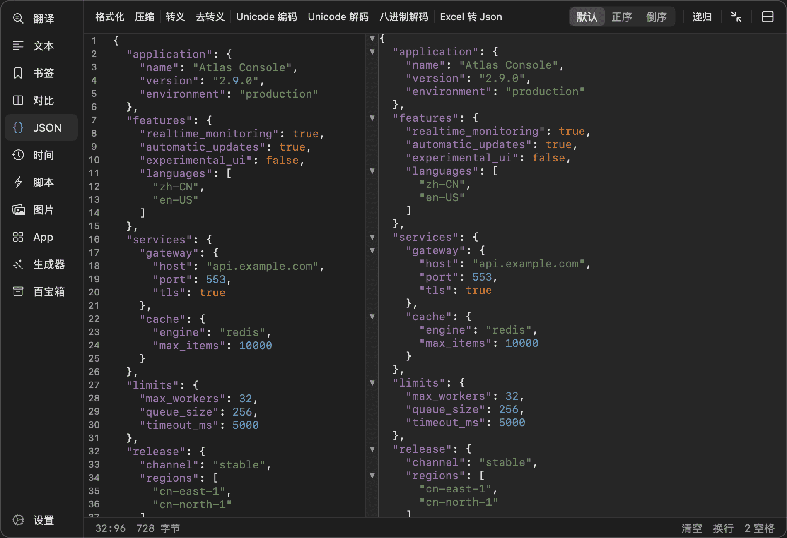
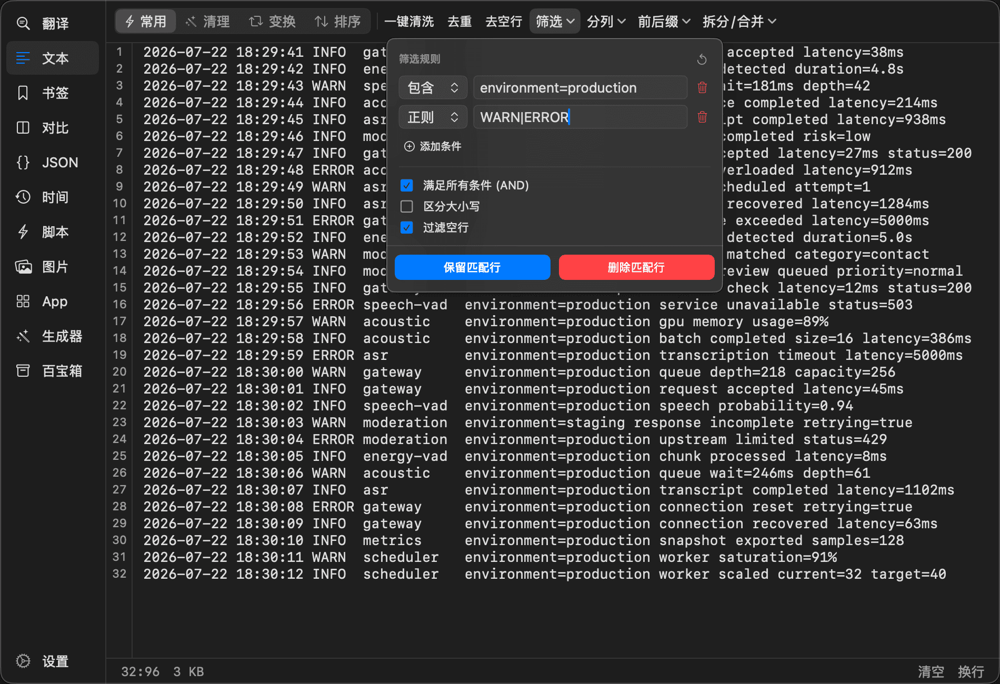

<div align="center">
  

  <h1>Yota</h1>

  <p><strong>复制即识别，脚本即工具。</strong></p>

  <p>一款常驻 macOS 菜单栏的原生开发工具，提供剪贴板识别、跨应用操作和本地脚本扩展。</p>

  <p>
    
    <a href="https://github.com/chengu61/Yota/releases/latest">
      
    </a>
  </p>

  <p>
    <a href="https://github.com/chengu61/Yota/releases/latest">下载</a>
    &nbsp;&middot;&nbsp;
    <a href="#安装">安装</a>
    &nbsp;&middot;&nbsp;
    <a href="./CHANGELOG.md">更新记录</a>
  </p>
</div>

<div align="center">
  <a href="./docs/image.png">
    
  </a>
</div>

## 工作方式

默认按下 `Shift + Space` 或点击菜单栏图标即可呼出，快捷键可以在设置中修改。工具可以按习惯排序或隐藏；切换工具时，各工作区会保留当前内容和操作状态。

## 剪贴板与跨应用操作

Yota 可以在后台识别剪贴板内容。识别采用严格规则，尽量避免普通数字、订单号和代码片段触发工具。

- 复制时间戳、ISO 8601、日志日期或中文日期时，在屏幕角落显示转换结果。
- 复制对象、数组或混合文本中嵌入的 JSON 时，自动进入 JSON 工具。
- 打开空白对比工具后连续复制两段文本，第一次加入左侧，第二次加入右侧并开始对比。
- 可以忽略连续复制的相同内容；打开 Yota 操作时，后台识别会暂时停止。
- 时间、JSON 和对比监控可以分别关闭。隐藏工具时，对应监控也会停用。

## 书签

书签可以按行或段落拆分内容。点击一次书签后，在浏览器、终端或其他应用中连续按 `Cmd + V`，Yota 会在每次粘贴完成后准备下一段。

- 支持全文、逐行、逐段和编辑四种点击动作。
- 使用双空行分隔内容和备注，备注不会进入逐段粘贴序列。
- 使用 <code>&#123;&#123;书签标题&#125;&#125;</code> 引用其他书签，并检测循环引用。
- 重命名书签时同步更新其他书签中的引用。
- 网格和列表视图、多标签、标签自动补全、拼音检索及拖拽排序。
- 使用次数统计、删除撤销、编辑未保存提醒和 JSON 导入导出。
- 私密内容默认模糊显示，`Cmd + 点击`可以临时预览。

自动推进剪贴板需要辅助功能权限；未授权时仍可手动复制各段内容。

## 图片

- **压缩**：批量处理 PNG、JPEG、WebP 和 HEIC，支持质量、最长边、并发压缩、压缩率统计及前后预览。结果比原图更大时保留原文件。
- **格式转换**：在 PNG、JPEG、WebP、HEIC 等格式之间批量转换，支持质量设置、预览和批量导出。
- **OCR**：使用 macOS Vision 在本地识别简体中文、繁体中文和英文，支持图像放大、对比度预处理、分块结果和复制全文。
- **Base64**：图片与 Base64 双向转换，支持 Data URI 前缀、实时预览和还原保存。
- **编辑**：智能抠图、蒙版擦除和恢复、裁切、旋转、翻转、画布缩放、画笔、形状、箭头、模糊和马赛克，支持撤销和重做。
- **元数据**：查看尺寸、色彩空间、相机、曝光和 GPS 等 EXIF 信息，可以单张或批量清除元数据后另存。

## 对比

- 使用针对大文本优化的 Myers 差分和锚点分治算法，差异在后台计算。
- 左右视图保持物理行高对齐并同步滚动。
- 同时显示行级、词级和字符级差异。
- 差异缩略图显示全局分布，可以点击或拖动定位。
- 支持搜索、差异统计、上一个或下一个差异、交换左右内容。
- 点击差异箭头，可以将连续差异块采纳到另一侧。
- 空格、换行和大小写变化可以标记为次要差异并忽略。
- 支持拖入文本文件；两侧均为 JSON 时，可以格式化并按键名排序后比较。

<div align="center">
  <a href="./docs/compare.png">
    
  </a>
</div>

## 脚本

将 Python、Node.js、Shell 或 Ruby 脚本所在的文件夹添加为脚本库，Yota 会自动发现脚本。文件夹发生变化后，脚本列表会自动刷新。

脚本头部可以使用 YAML 注释声明参数，Yota 根据声明生成原生表单。支持：

- 文本、多行文本、数字、滑块、开关、下拉选择、文件和目录八种控件。
- 必填校验、数值上下限、步长、密码遮挡和 `show_if` 参数联动。
- 自动发现 Python `.venv` / `venv`，并从系统环境中查找其他解释器。
- 多个脚本库、脚本分类、置顶、拼音检索和运行状态保留。
- 新建脚本、语法高亮编辑、搜索、保存后运行和未保存提醒。
- 实时显示 stdout 和 stderr，支持停止进程、复制日志及交互式 stdin。
- 通过 stdout JSON 指令请求用户输入、复制结果或打开 URL。

脚本格式和主程序指令可在应用内的“脚本开发手册”中查看。

<div align="center">
  <a href="./docs/automation.png">
    
  </a>
</div>

## JSON

- 从日志、接口响应或其他混合文本中提取多个合法 JSON 片段，并在片段之间切换。
- 根据内容占比和代码上下文过滤误识别，可以单独控制是否识别纯数组。
- 递归解析字符串中的 JSON，处理多层转义内容。
- 有序解析器保留输入键序，也支持正序、倒序和 2/4 空格缩进。
- 格式化、压缩、提取、转义和去转义、Unicode、八进制转义及 Excel TSV 转 JSON。
- Excel 长数字自动保留为字符串，避免精度丢失。
- 树形浏览、节点展开和折叠、路径追踪、搜索及左右或上下布局。
- 包含嵌套深度保护，语法错误会定位到字符偏移量。

<div align="center">
  <a href="./docs/json.png">
    
  </a>
</div>

## 文本

- 多条件保留或排除，支持包含、正则、开头、结尾、精确匹配、AND/OR 和大小写控制。
- 自动识别分隔符并生成采样预览，可以拖动选择列并自定义连接符。
- 批量添加或移除前后缀，智能拆分单行或合并多行。
- 文本或数值排序、随机打乱、反转、去重、去空行、去空白和符号清理。
- 生成 SQL `IN` 参数，支持引号和自动去重。
- camelCase、snake_case、PascalCase、kebab-case 及大小写转换。
- 添加或移除行号、中英文标点互转、简繁体互转和身份证敏感行过滤。
- 自动识别数字与数学表达式并求和；状态栏显示行列、字符数、字节数和计算结果。
- 原生编辑器支持行号、搜索替换、跳转行列、语法高亮、自动换行和字号调整。

<div align="center">
  <a href="./docs/text.png">
    
  </a>
</div>

## 时间

- 秒、毫秒、微秒、纳秒及带小数的秒时间戳与日期互转。
- 识别 ISO 8601、RFC 2822/1123、Nginx/Apache、Syslog、紧凑日期和中文日期。
- 后台监控使用严格规则，前台手动输入使用宽松规则。
- 识别 `3600`、`1h`、`1小时30分` 等时长，并显示对应语义和预计到期时间。
- 在基准时间上加减年、月、日、时、分、秒。
- 计算两个时间点之间的自然时差和总秒数。
- 获取当前时间、当天零点、本周、本月和本年首尾等常用时间。

## App

- 扫描系统和用户应用目录，监听安装、更新和卸载变化。
- 对应用覆盖更新期间暂时不完整的 Bundle 和图标进行缓存和重试。
- 支持拼音全拼、简拼、多音字和模糊搜索，点击应用即可启动。
- 应用可以拖拽排序、隐藏，并调整图标大小。
- 深度卸载会检查缓存、偏好、容器、WebKit、插件、LaunchAgent、LaunchDaemon 和相关二进制。
- 根据匹配置信度决定默认选中项；每个项目都可以预览、取消选择或在 Finder 中确认，最终移入废纸篓。

## 生成器

- 使用 <code>&#123;&#123;variable&#125;&#125;</code> 模板组织输出，输入 <code>&#123;&#123;</code> 时自动补全变量。
- 点击变量插入光标位置，`Cmd + 点击`从模板跳转到变量定义。
- 修改变量名时同步更新模板引用。
- 数字序列、随机数字、UUID、随机字符串、日期时间、正则反向生成、JavaScript 表达式、自定义列表和网络信息。
- 字段可以引用前置字段，用于生成有关联的数据。
- 实时预览纯文本、JSON、CSV 和 SQL Insert。
- 方案支持保存、复制、导入和导出，最多生成 99,999 条数据。

## 百宝箱

- **快捷公式**：保存表达式或完整 JavaScript 规则，支持单值和 JSON 输入、实时求值、BigInt，以及 MD5、SHA、CRC32、Base64 等辅助函数；支持 JSON 导入导出。
- **路径解析**：自动读取 Finder 当前选择，查看路径、时间、缩略图、哈希及文本和媒体信息；分析目录占用，并支持多种路径复制及在 Finder、Terminal 中打开。
- **编码转换**：Unicode、URL、Base64、Hex、Hex Escape、Octal Escape、Binary、HTML Entity、字符串转义、Hash 和 JWT。
- **Crontab**：校验 5 段或 6 段表达式，解释范围、列表、步长、英文月份和星期，并计算后续运行时间。
- **随机生成**：批量生成字符串、范围数字和 UUID，支持自定义字符集、排除易混字符、禁止重复数字及单项重新生成。
- **进制转换**：2、8、10、16 进制实时联动，二进制四位分组，输入范围为 UInt64。
- **二维码**：生成、复制和保存 PNG；从剪贴板图片、文件、路径、拖拽或网络图片 URL 解码，使用 Vision 和 Core Image 双引擎识别。
- **拾色器**：全屏取色，联动 HEX、RGB、HSB、HSL、Swift 和 CMYK；计算 WCAG 对比等级，并生成邻近色、互补色、三角色和单色调色板。

## 翻译

- 自动识别中英文方向，并将代码标识符中的下划线转换为空格后查询。
- 并发请求多个在线来源，结果逐步显示，单个来源失败不会阻塞其他结果。
- 合并重复结果，保留词性和详细释义，优先显示主要翻译。
- 结合系统拼音和在线结果纠正注音，支持复制单项结果。

## 安装

支持 macOS 12.0 及以上版本，以及 Apple Silicon 和 Intel Mac，不需要注册或登录。

1. 从 [GitHub Releases](https://github.com/chengu61/Yota/releases/latest) 下载最新 DMG。
2. 打开 DMG，将 Yota 拖入“应用程序”。
3. 启动后，可以通过应用内自动更新获取后续版本。

首次运行时如果 macOS 提示应用已损坏，请确认应用位于 `/Applications/Yota.app`，然后执行：

```bash
xattr -rd com.apple.quarantine "/Applications/Yota.app"
```

## 数据与权限

设置、书签、公式、生成方案和脚本库配置保存在本机；图片、文本、JSON、时间、文件分析和 OCR 等功能也在本机处理。书签的私密内容仅做界面遮挡，不是加密存储。

翻译会将待翻译文本发送到第三方服务；从网络图片 URL 识别二维码时会下载对应图片；点击图片中的 GPS 坐标会打开 Apple 地图。自动更新会下载版本信息和安装包，但不会发送系统配置资料；PNG 压缩缺少本地压缩引擎时，可以按提示下载，图片不会上传。用户添加的脚本是否访问网络或文件，由脚本自身决定。

书签逐段粘贴需要可选的辅助功能权限；读取 Finder 选择和在 Terminal 中打开路径会使用 Apple Events。为了支持脚本执行、应用管理和跨应用操作，Yota 不运行在 App Sandbox 中。

## 反馈

[提交问题或建议](https://github.com/chengu61/Yota/issues) &nbsp;&middot;&nbsp; [查看更新记录](./CHANGELOG.md) &nbsp;&middot;&nbsp; [下载最新版本](https://github.com/chengu61/Yota/releases/latest)

<div align="center">
  <sub>From Iota to Yotta. 始于极微，致于无穷。</sub>
</div>
