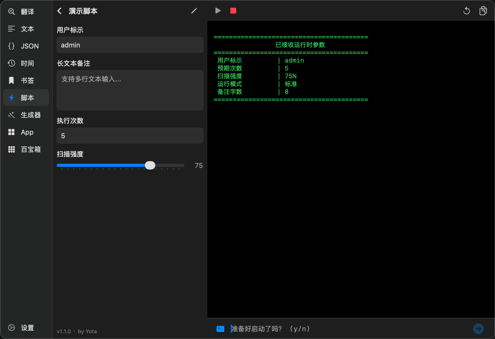

  

  <h1>Yota v2</h1>

  

    <strong>macOS 开发者生产力工具箱 | 原生 · 极速 · 智能</strong>
  

  

    <em>From Iota to Yotta.</em> 
    始于极微，致于无穷
  

  

    
    
    
  

  

    <a href="https://github.com/chengu61/Yota/releases/latest">🚀 立即下载最新版本</a>
  

 

Yota 是一款专为 macOS 开发者设计的轻量级工具箱。它常驻于 Menu Bar，旨在为您提供即用即走的极致开发体验。

---

### 自动化脚本 [NEW]

将本地脚本 (Python, Node.js, Shell, Ruby) 转化为 Yota 生产力工具：

- **协议驱动**: 只需在脚本头部添加简单的 YAML 配置注释，即可自动生成 **原生 UI 输入表单**。
- **参数联动**: 支持 `show_if` 逻辑，实现复杂的参数显示/隐藏控制。
- **环境隔离**: 自动识别脚本目录下的虚拟环境（如 Python `.venv`），确保运行环境的一致性。
- **深度交互**: 脚本通过标准输出 JSON 指令直接唤起宿主能力（如：复制结果、请求用户确认、打开 URL 等）。
- **多端触达**: 无论是数据处理脚本还是系统运维命令，一键点击启动，实时查看运行输出。

### 百宝箱

低频但刚需的小工具聚合中心：

- **编码转换**: Base64、URL、Unicode 的极速加解密。
- **CRON 预览**: 直观解析 Crontab 表达式的执行周期。
- **进制互转**: 完美支持 2 / 8 / 10 / 16 进制之间的快捷切换。
- **随机实验室**: 多维度生成 UUID、高强度随机字符串及数字。
- **原生拾色**: 支持全屏点选取色。

### App 工具

全方位管理 macOS 应用程序：

- **灵活组织**: 支持应用列表展示，并可根据您的使用习惯 **自由拖拽排序**。
- **个性化视图**: 支持 **图标大小** 调节；支持 **隐藏** 不常用的系统或第三方应用。
- **深度卸载**: 内置强力卸载引擎，自动扫描并清理关联的**残留文件**。
- **极速检索**: 支持拼音全拼、简拼及多音字搜索，瞬间定位目标应用。

### 生成工具

强大的模拟数据构造中心，支持高度定制化的复杂数据生成：

- **核心引擎**: 支持 `{ {variable} }` 模板语法，满足高度定制化需求。
- **高效录入**: 模板编辑器支持 `{ {` 触发自动补全；支持将变量**快速插入**至光标当前位置。
- **智能重构**: 修改变量名时模板引用 **自动同步**；支持 `Cmd+点击` 实现模板与定义间的 **快速溯源**。
- **数据源丰富**: 内置正则、逻辑脚本、Mock 数据及自定义列表，支持 String/Number/Date 等基础类型。
- **多格式导出**: 支持 **JSON**、**CSV**、**SQL Insert** 等主流格式，并支持生成方案的本地持久化。

### JSON 工具

支持从简单的格式化到复杂的架构分析全流程：

- **核心操作**: 极速 **格式化/压缩**；支持 **Unicode 与中文** 互转。
- **有序解析**: 自研解析引擎，支持自定义 **缩进 (2/4)** 与 **键值排序** (默认/正序/倒序)。
- **可视化视图**: 提供树状结构预览，支持节点展开/折叠及路径快速定位。
- **系统集成**: **智能去转义** (Smart Unescape)；支持 **Excel (TSV) 转 JSON** 并提供长数字精度保护。
- **安全保障**: 512 层递归深度限制，精准报错至字符偏移量。

### 文本工具

集成了数十种日常开发高频使用的文本处理能力：

- **分割与合并**: **智能双向转换**。单行按高频字符（逗号、分号等）自动分割，多行按空格一键合并。
- **行级操作**: 排序（升序/降序/数字识别）、去重、去除空行/首尾空格。
- **清洗与过滤**: 一键移除符号、清洗身份证号敏感行等。
- **数学与统计**: 支持对数字行进行 **求和计算**；提供字数、字节数实时统计。
- **智能生成**: 快速生成指定长度的随机字符串（含数字/字母）。
- **文本转换**: 中英文标点互转、简繁体互转、编码转换。
- **编辑器**: 内置高性能代码高亮编辑器，支持原生查找替换与 **自动换行** 切换。

### 时间工具

涵盖从时间戳转换到复杂推算的完整链路：

- **全格式互转**: 秒/毫秒/微秒/纳秒时间戳与标准日期秒级互转。
- **智能解析**: 识别 ISO8601、yyyyMMdd 等 40+ 种格式。
- **高级推算**:
    - **时间推算**: 在基准时间上灵活加减年、月、日、时、分、秒。
    - **时差计算**: 精确分析两个时间点间的间隔。
- **一键填充**: 预设当前时间、零点、本周首尾等常用快照。
- **静默交互**: 复制时间内容时弹出 **安静的悬浮窗** 反馈，不再打断您的工作流程。

### 翻译工具

- **弹性检索**: 多节点轮询机制，确保请求的高度稳定性。
- **智能融合**: 自动纠偏拼音，合并碎片化释义并保留完整词性说明。

### 书签工具

代码片段与常用指令的私密管理中心：

- **灵活组织**: 支持 **多标签管理**、标签自动补全 (Ghost Text) 以及 **拖拽重排序**。
- **隐私模式**: 敏感内容支持 **高斯模糊** 遮盖，通过 `Cmd + 点击` 快速预览。
- **操作优化**: 点击复制书签后 **窗口自动关闭**，提供更连贯的交互体验。
- **安全保障**: 引入撤销机制 (Undo) 防止误删；编辑窗口支持未保存提醒。
- **数据迁移**: 支持 JSON 格式的全量导入与导出备份。

---

## ⚠️ 安装必读

- **系统要求**: macOS 12.0+
- **关于权限**: 由于应用未签名，首次打开可能会提示 **“无法打开”** 或 **“文件已损坏”**
  。请在系统设置中检查“允许任何来源”选项，或使用终端命令 (`xattr -cr`) 自行修复。

---

## 📌 更多信息

- **💬 反馈与建议**: 如果在使用中遇到 Bug 或有新想法，欢迎提交 [GitHub Issue](https://github.com/chengu61/Yota/issues)。
- **📝 更新日志**: 了解 Yota 的最新功能与优化详情，请查看 [CHANGELOG](./CHANGELOG.md)。
