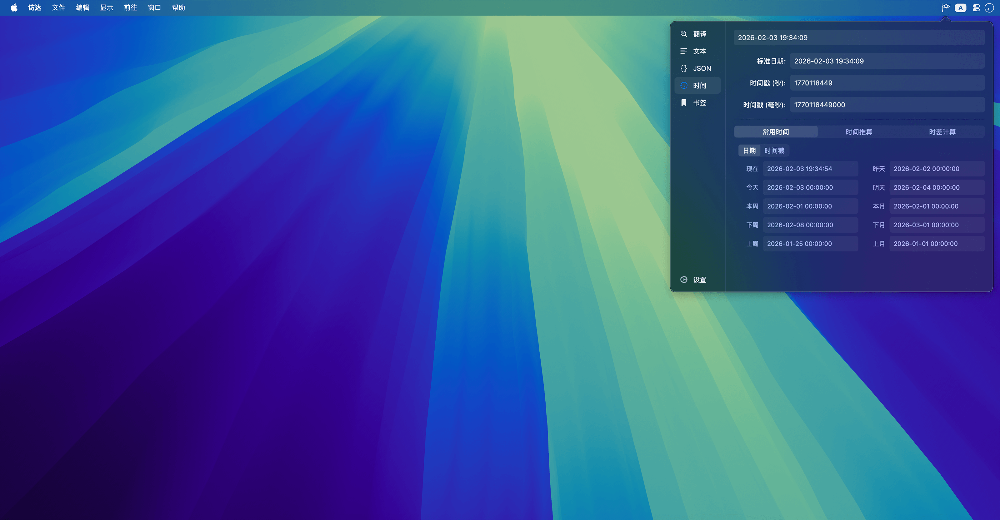

  

  <h1>Yota v2.0</h1>

  

    <strong>macOS 开发者生产力工具箱 | 原生 · 极速 · 智能</strong>
  

  

    <em>From Iota to Yotta.</em> 
    始于极微，致于无穷
  

  

    
    
    
  

  

    <a href="https://github.com/chengu61/Yota/releases/latest">🚀 立即下载最新版本</a>
  

 

Yota 是一款专为 macOS 开发者设计的轻量级工具箱。它常驻于 Menu Bar，旨在为您提供即用即走的极致开发体验。

---

## ✨ 全量功能指南

### 1. JSON 深度处理中心
支持从简单的格式化到复杂的架构分析全流程：
- **核心操作**: 极速 **格式化/压缩**；支持 **Unicode 与中文** 互转。
- **有序解析**: 自研解析引擎，支持自定义 **缩进 (2/4)** 与 **键值排序** (默认/正序/倒序)。
- **可视化视图**: 提供树状结构预览，支持节点展开/折叠及路径快速定位。
- **系统集成**: **智能去转义** (Smart Unescape)；支持 **Excel (TSV) 转 JSON** 并提供长数字精度保护。
- **安全保障**: 512 层递归深度限制，精准报错至字符偏移量。

### 2. 多功能文本工具箱
集成了数十种日常开发高频使用的文本处理能力：
- **行级操作**: 排序（升序/降序/数字识别）、去重、去除空行/首尾空格。
- **清洗与过滤**: 一键移除符号、清洗身份证号敏感行等。
- **数学与统计**: 支持对数字行进行 **求和计算**；提供字数、字节数实时统计。
- **智能生成**: 快速生成指定长度的随机字符串（含数字/字母）。
- **文本转换**: 中英文标点互转、简繁体互转、编码转换。
- **编辑器**: 内置高性能代码高亮编辑器，支持原生查找替换与 **自动换行** 切换。

### 3. 时间与日期分析
涵盖从时间戳转换到复杂推算的完整链路：
- **全格式互转**: 秒/毫秒/微秒/纳秒时间戳与标准日期秒级互转。
- **智能解析**: 识别 ISO8601、yyyyMMdd 等 40+ 种格式。
- **高级推算**:
    - **时间推算**: 在基准时间上灵活加减年、月、日、时、分、秒。
    - **时差计算**: 精确分析两个时间点间的间隔。
- **一键填充**: 预设当前时间、零点、本周首尾等常用快照。

### 4. 查词与深度翻译
- **弹性检索**: 多节点轮询机制，确保请求的高度稳定性。
- **智能融合**: 自动纠偏拼音，合并碎片化释义并保留完整词性说明。

### 5. 原生快捷书签
代码片段与常用指令的私密管理中心：
- **灵活组织**: 支持 **多标签管理**、标签自动补全 (Ghost Text) 以及 **拖拽重排序**。
- **隐私模式**: 敏感内容支持 **高斯模糊** 遮盖，通过 `Cmd + 点击` 快速预览。
- **安全保障**: 引入撤销机制 (Undo) 防止误删；编辑窗口支持未保存提醒。
- **数据迁移**: 支持 JSON 格式的全量导入与导出备份。

---

## 🚀 进阶特性

- **响应式排版**: 内置两级动态字体系统，窗口大小拉伸时自动调整密度。
- **复制反馈**: 所有应用内复制操作适配物理动画弹簧效果与状态同步。
- **窗口管理**: 支持窗口单实例激活，避免重复开启；内置临时全屏模式。

## ⚠️ 安装必读

- **系统要求**: macOS 12.0+
- **关于权限**: 由于应用未签名，首次打开可能会提示 **“无法打开”** 或 **“文件已损坏”**。请在系统设置中检查“允许任何来源”选项，或使用终端命令 (`xattr -cr`) 自行修复。

## ⌨️ 核心快捷键

- **唤起应用**: `Shift + Space` (自定义全局热键)
- **临时全屏**: `Cmd + Return` (查看长 JSON/文本时极力推荐)
- **快速保存**: `Cmd + S` (在书签编辑界面)

---

  
© 2026 Yota Team. 基于原生 Swift 构建。

